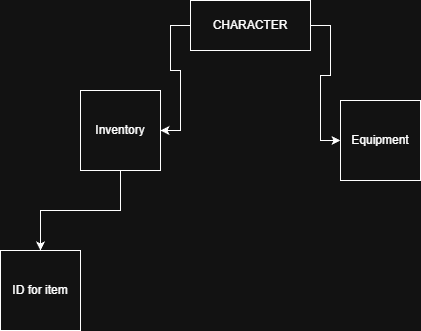

# Inventory System using Multiset Design
---
## Introduction to the setting

### The context for this inventory design is related to the game, the game this inventory will be implemented into is Top down Traditional roguelike. the setting will be a military complex set in the far future. the player character is a fully atonamized mech built to scale the complex. my inventory will need multiple features such as:

* ### multiple items
* ### same name items
* ### Expandable
* ### retractable
* ### sorting
* ### search function

### therefore my design needs to store items with the same name with information such as item amount and needs to be expandable and retractable, for this reaon i'll be using **Sequence\<string>\**
---
## Why Sequence

### The reason I am using Sequence is for an easier faster implementation within the project

### Because my inventory needs to be expandable and retractable i feel that a Sequence set would be easist to modify the size of throughout the game, using A sequence would lower the development time of my project by a signifigant amount

### This Sequence will be used and interacted by the user, The inentory system will be connected to the player character as seen in this diagram

### The ID system will allow for easy implementation and readibility for items and updates to items, as well as the implementation of new items
---
## Operations

### these are five operations that a multi set must have

| Operation | Time Complexity |
| :------- | :------: |
| insert | O(1) |
| delete | O(N) |
| search | O(N) |
| clear | O(N) |
| get | O(N) |

### Insert: will be appended on to the end of the list if there is enough space in the inventory

### delete: will search the list for an ID and remove item

### Search: will search the list using a linear method to find all items containing searched text

### clear: will clear all items from the inventory dropping them to the ground

### get: will select the chosen item for use
---
## Edge cases

### when lowering inventory space any items that do not fit in the new space will be drpped

### when deleting an item that occurs mutiple times it will prompt the user for the correct one same for get
---
## the use of Sequence

### the use of sequence allows for quick removal the top of the list which we be useful when changing inventory size

### one constraint is searching will be slower than other methods
---
## Set Operations

### my games invintory will have a couple interactions 

| Operation |
| :------- |
| union | 
| difference |
## Union

### in my game union will be used to quick stack items from any source to the inventory and vice versa, this allows for quick inventory management with other systems

### union will use get and delete to remove items from the sequence and move them to the other system

## difference

### difference will be used to show the differense in inventory, this could be used to show what new items you could get from an enemy or what new items would be valuable to trade for in game

### the implementation would be to iterate through the sequence and log all the items then iterate through the other list and print only items that dont appear
---
## 
